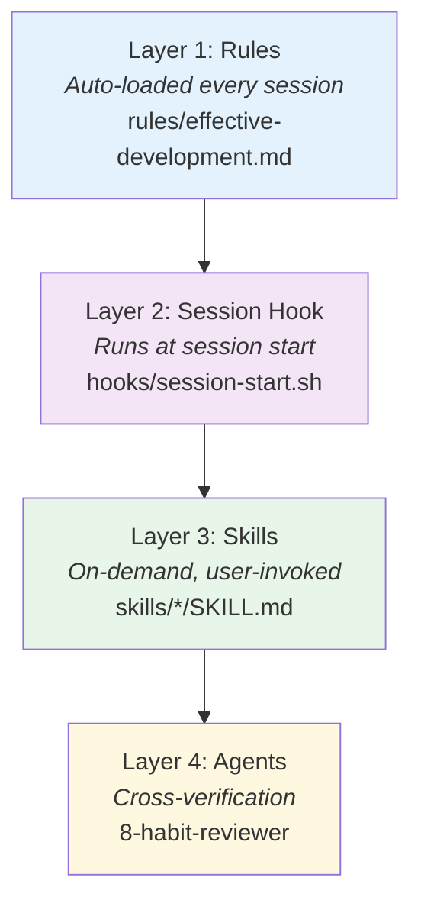

# Architecture

The plugin is a **pure-markdown Claude Code plugin** with zero runtime dependencies. No build system, no `npm install` — just structured markdown files that Claude Code loads at runtime to shape its development behavior.

> [!NOTE]
> Understanding the architecture is optional for using the plugin. This page is for contributors and curious users who want to know how the pieces fit together.

## 4-Layer Loading Model

The plugin loads content in 4 layers, each with different timing and scope:



### Layer 1: Rules (always active)

`rules/effective-development.md` is loaded automatically into every Claude Code session via Claude's rules system. It contains the full 8-Habit playbook with Rules, Anti-patterns, and Checkpoints per habit. This is the foundation — always present in context, shaping Claude's behavior even if no skills are invoked.

### Layer 2: Session Hook (session start)

`hooks/session-start.sh` runs once at the start of every session. Budget: **≤300 tokens** (enforced by `test-verbosity-hook.sh`).

Responsibilities:

- Print the 7-step workflow reminder
- Detect workflow progress (existing PRD/ADR/TASKS artifacts)
- Read `~/.claude/habit-profile.md` and emit maturity-level adaptation directive
- Respect `HABIT_QUIET=1` opt-out (ADR-006)

### Layer 3: Skills (on-demand)

17 skills in `skills/*/SKILL.md`, loaded only when the user invokes them (e.g., `/requirements`, `/design`). Each skill has YAML frontmatter:

```yaml
---
name: <skill-name>
description: >
  When to use this skill
user-invocable: true
argument-hint: "[arg description]"
allowed-tools: ["Read", "Glob", "Grep"]
prev-skill: <predecessor|any|none>
next-skill: <successor|any|none>
---
```

**Progressive disclosure** (v2.10.0, ADR-009): Three large skills use a `SKILL.md + reference.md + examples.md` triad. The main SKILL.md loads, then pulls in reference/examples only when needed via `Load ${CLAUDE_PLUGIN_ROOT}/...` directives.

### Layer 4: Agents (cross-verification)

`8-habit-reviewer` — a read-only agent (`Read`, `Glob`, `Grep` tools only, model: `sonnet`) invoked by `/cross-verify`. Performs deep 17-question analysis against all 8 habits independently.

`research-verifier` — validates cited URLs and file paths in research briefs.

## Handoff Contracts

Every workflow skill declares `prev-skill` and `next-skill` in its frontmatter, creating a directed acyclic graph (DAG):

```
/research → /requirements → /design → /breakdown → /build-brief → /review-ai → /deploy-guide → /monitor-setup
```

Each skill documents:

- **Expects from predecessor**: what input it needs
- **Produces for successor**: what output the next step consumes

> [!IMPORTANT]
> The DAG is machine-verified. `tests/test-skill-graph.sh` validates: no cycles, no dangling references, symmetric edges, no orphan skills.

## Fitness Functions

4 validators run in CI with **482+ total assertions**:

| Validator                | What it checks                                                             |
| ------------------------ | -------------------------------------------------------------------------- |
| `validate-structure.sh`  | Skill frontmatter, directory structure, version consistency across 4 files |
| `validate-content.sh`    | Skill complexity (word budget), content depth, cross-reference integrity   |
| `test-skill-graph.sh`    | DAG integrity — cycles, dangling refs, symmetric edges, orphans            |
| `test-verbosity-hook.sh` | 12 assertions across all 8 hook branches + HABIT_QUIET + token budget      |

## Architecture Decision Records

Every non-trivial decision is documented in `docs/adr/`:

| ADR                                                                                                                      | Decision                                        |
| ------------------------------------------------------------------------------------------------------------------------ | ----------------------------------------------- |
| [001](https://github.com/pitimon/8-habit-ai-dev/blob/main/docs/adr/ADR-001-orchestration-patterns.md)                    | Orchestration patterns for multi-step workflows |
| [002](https://github.com/pitimon/8-habit-ai-dev/blob/main/docs/adr/ADR-002-research-modes.md)                            | Research skill modes and depth levels           |
| [003](https://github.com/pitimon/8-habit-ai-dev/blob/main/docs/adr/ADR-003-content-validation.md)                        | Content validation fitness functions            |
| [004](https://github.com/pitimon/8-habit-ai-dev/blob/main/docs/adr/ADR-004-wiki-as-artifact.md)                          | Wiki stored as build artifact in source control |
| [005](https://github.com/pitimon/8-habit-ai-dev/blob/main/docs/adr/ADR-005-eu-ai-act-toolkit.md)                         | EU AI Act compliance toolkit scope              |
| [006](https://github.com/pitimon/8-habit-ai-dev/blob/main/docs/adr/ADR-006-audience-honesty-and-superpowers-deferral.md) | Audience honesty + HABIT_QUIET opt-out          |
| [007](https://github.com/pitimon/8-habit-ai-dev/blob/main/docs/adr/ADR-007-agentskills-compatibility-decision.md)        | agentskills.io compatibility (NO-GO)            |
| [008](https://github.com/pitimon/8-habit-ai-dev/blob/main/docs/adr/ADR-008-user-maturity-calibration-design.md)          | User maturity calibration design                |
| [009](https://github.com/pitimon/8-habit-ai-dev/blob/main/docs/adr/ADR-009-skill-split-convention.md)                    | Progressive-disclosure skill split convention   |

## Guides & Templates

The `guides/` directory contains supporting material referenced by skills:

- **Templates**: PRD, task list, review, lesson, interview protocol, ADR
- **Reference docs**: EARS notation, cross-verification questions, whole-person rubrics
- **Protocols**: Structured output format, orchestration patterns, verbosity adaptation rules
- **Cross-verify packs**: Domain-specific question sets (API, frontend, infra, AI/ML, mobile)

## See also

- [Skills Catalog](Skills-Reference)
- [Maturity Model](Maturity-Model)
- [Changelog](Changelog)
