# 7-Step Workflow Overview

The antidote to vibe coding. Each step is a Claude Code skill, maps to one of Covey's 8 Habits, and has an explicit handoff contract with the next step.

## The 7 Steps (+ Step 0)

```mermaid
flowchart LR
    R["0 · /research\nH5 Understand"]:::optional --> RQ["1 · /requirements\nH2 End in Mind"]:::human
    RQ --> D["2 · /design\nH8 Voice"]:::human
    D --> B["3 · /breakdown\nH3 First Things"]:::optional
    B --> BB["4 · /build-brief\nH5 Understand"]:::optional
    BB --> RA["5 · /review-ai\nH4 Win-Win"]:::never_skip
    RA --> DG["6 · /deploy-guide\nH1 Proactive"]:::human
    DG --> M["7 · /monitor-setup\nH7 Sharpen Saw"]:::optional

    classDef optional fill:#e8f5e9,stroke:#4caf50
    classDef human fill:#fce4ec,stroke:#e91e63
    classDef never_skip fill:#fff3e0,stroke:#ff9800
```

> Green = optional entry point · Pink = human checkpoint required · Orange = **never skip**

| Step | Skill                                    | Habit                 | Output                        | Human checkpoint? |
| ---- | ---------------------------------------- | --------------------- | ----------------------------- | ----------------- |
| 0    | [`/research`](Step-0-Research)           | H5 Understand First   | Research brief                | Optional          |
| 1    | [`/requirements`](Step-1-Requirements)   | H2 Begin with End     | PRD summary                   | Yes               |
| 2    | [`/design`](Step-2-Design)               | H8 Find Your Voice    | Architecture decisions (ADR)  | **Required**      |
| 3    | [`/breakdown`](Step-3-Breakdown)         | H3 First Things First | Atomic task list              | Optional          |
| 4    | [`/build-brief`](Step-4-Build-Brief)     | H5 Understand First   | Implementation brief per task | Optional          |
| 5    | [`/review-ai`](Step-5-Review-AI)         | H4 Win-Win            | Code review findings          | **Required**      |
| 6    | [`/deploy-guide`](Step-6-Deploy-Guide)   | H1 Be Proactive       | Deploy plan + rollback        | **Required**      |
| 7    | [`/monitor-setup`](Step-7-Monitor-Setup) | H7 Sharpen the Saw    | Observability config          | Optional          |

## Handoff Contracts

Each skill declares `prev-skill` and `next-skill` in its frontmatter and explicitly documents:

- **Expects from predecessor**: what input the skill needs
- **Produces for successor**: what output the next step will consume

This prevents context loss between steps and makes the workflow composable.

> [!NOTE]
> The handoff DAG is machine-verified by `tests/test-skill-graph.sh` — no cycles, no dangling references, symmetric edges.

## When to Skip

| Change type                              | Steps to run           |
| ---------------------------------------- | ---------------------- |
| Single-line bug fix (obvious root cause) | 5                      |
| Formatting / linting                     | 5                      |
| Dependency version bump                  | 5, 6                   |
| New feature (small, <3 files)            | 1, 3, 4, 5, 6          |
| New feature (medium)                     | 1, 2, 3, 4, 5, 6, 7    |
| New feature (complex / unclear domain)   | 0, 1, 2, 3, 4, 5, 6, 7 |
| Refactor (no behavior change)            | 2, 3, 4, 5             |
| Architecture change                      | 0, 1, 2, 3, 4, 5, 6, 7 |

> [!WARNING]
> **Never skip `/review-ai` (Step 5).** Every other step has legitimate skip cases; review does not.

## Beyond the Workflow

These skills complement the pipeline and can run at any point:

**Assessment:**

- [`/cross-verify`](Skills-Reference#cross-verify) — 17-question 8-Habit checklist
- [`/whole-person-check`](Skills-Reference#whole-person-check) — Body/Mind/Heart/Spirit balance
- [`/security-check`](Skills-Reference#security-check) — OWASP Top 10 focused review
- [`/reflect`](Skills-Reference#reflect) — post-task retrospective with lesson persistence
- [`/workflow`](Skills-Reference#workflow) — interactive guided walkthrough

**Meta & Onboarding:**

- [`/using-8-habits`](Skills-Reference#using-8-habits) — onboarding decision tree
- [`/calibrate`](Skills-Reference#calibrate) — maturity self-assessment, verbosity adaptation

**Compliance & Audit:**

- [`/eu-ai-act-check`](Skills-Reference#eu-ai-act-check) — EU AI Act 9-obligation checklist
- [`/ai-dev-log`](Skills-Reference#ai-dev-log) — AI development log from git history

## See also

- **[Skills Catalog](Skills-Reference)** — all 17 skills with when-to-use guidance
- **[Habits Reference](Habits-Reference)**
- **[Vibe Coding vs Structured](Vibe-Coding-vs-Structured)**
